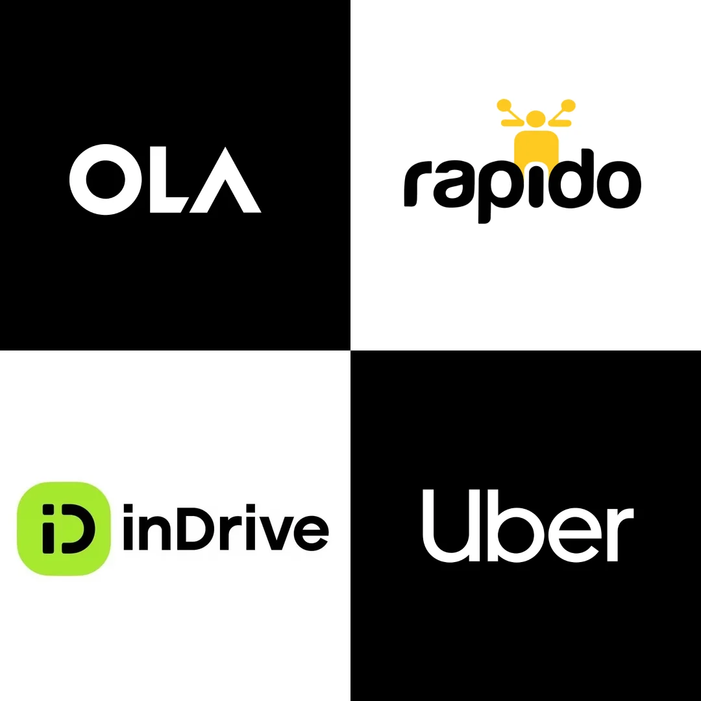

# Adjusted Ride Cost Prediction Using CatBoost Regression

Earlier taxi services calculated fares using a fixed-rate model that was mostly dependent on distance, like ₹7/km or ₹12/km. Despite being straightforward, this method overlooked real-time variables like driver availability or demand spikes. For instance, it might be difficult to charge a flat rate in high-demand areas or during peak hours when there are many riders but fewer drivers. Modern ride-hailing services like Ola, Uber and others have implemented dynamic pricing to manage this variability. Based on a number of real-time factors, including the vehicle type, ride duration and supply-demand ratio, fares are adjusted.

 

 

To meet this need for dynamic pricing, I have created a machine learning regression model to predict adjusted ride costs based on factors like the number of riders, drivers, vehicle type and expected ride length. CatBoost Regressor model has been used for supervised learning and works well with both numerical and categorical data. It got a high R² score of 0.9003 by training on real-world ride patterns, which means it can make reliable fare predictions. This solution lets ride-sharing companies set prices that are fair, flexible and based on data, which makes customers happier and makes the business run more smoothly and also profitable by the optimized pattern of pricing.

 

## Data Understanding
  The dataset contains information about the number of drivers, riders, location, customer loyalty, ride time,etc. It consist of 1000 record, which is efficient enough to train a Machine Learning Model. Columns of the dataset include:
<ul>
  <li><code>Number_of_Riders</code> : Number of riders available around the user while booking.</li>
  <li><code>Number_of_Drivers</code> : Number of drivers available around the user while booking.</li>
  <li><code>Location_Category</code> : Type of Location (Rural, Urban, Suburban).</li>
  <li><code>Number_of_past_rides</code> : Number of past rides by the user.</li>
  <li><code>Time_Of_Booking</code> : Time of Booking (Morning, Afternoon, Evening, Night).</li>
  <li><code>Vehicle_Type</code> : Type of vehicle booked (Premium, Economy).</li>
  <li><code>Expected_Ride_Duration</code> : Expected duration to complete the ride (in minutes).</li>
  <li><code>Historical_Cost_Of_Ride</code> : Cost of the respective ride.</li>
</ul>
 

## 
